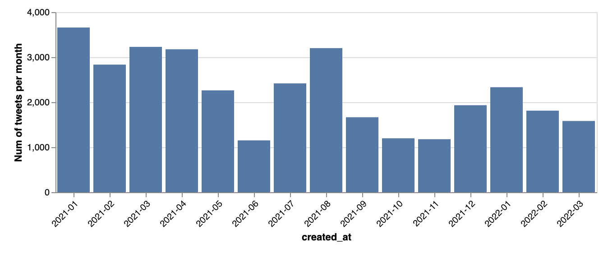
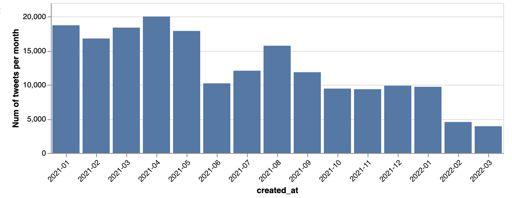
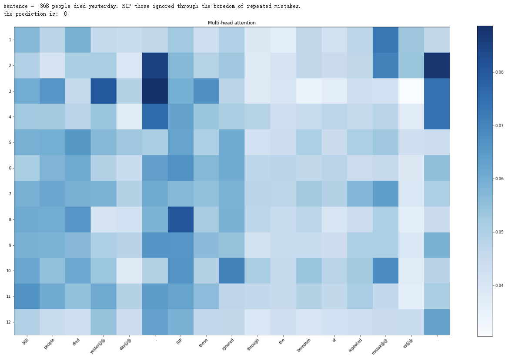
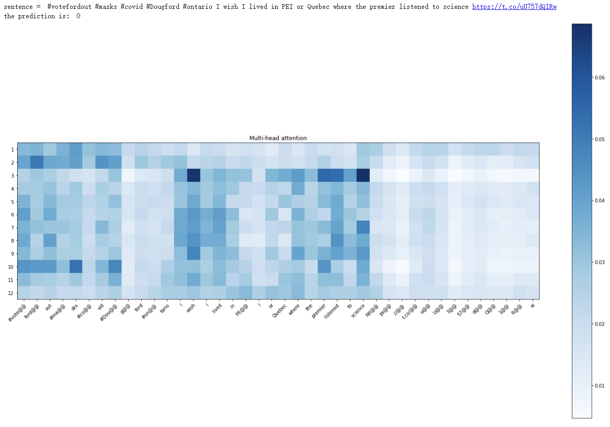
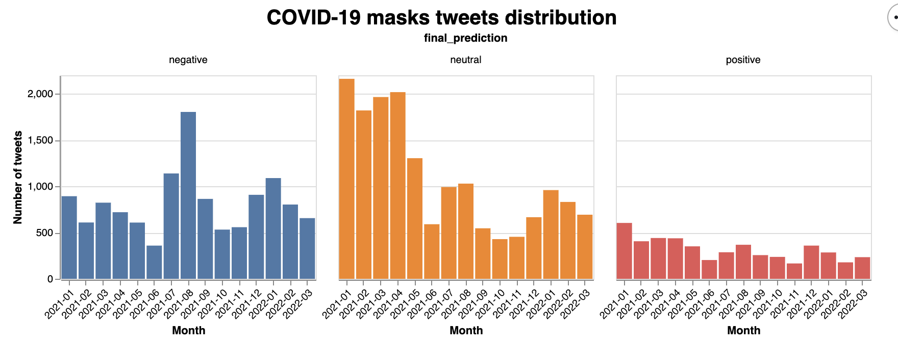
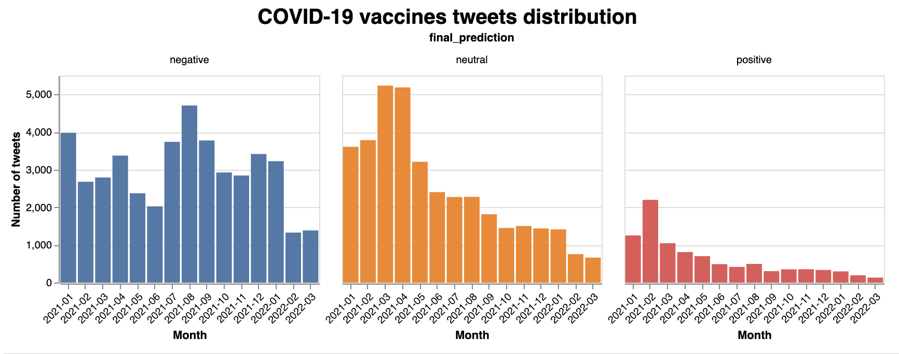

# COVID-19 sentiment project


## Abstract


In this project report we present the results of the most recent COVID-19 tweets sentiment analysis on a three-point scale. The report describes Twitter corpus collection as well as the ensemble model that is comprised of CNN+BiLSTM, BERTweet and fine-tuned BERTweet. Upon building the final model, the predictions on the corpus of tweets are gathered and filtered based on the ensemble constituents' agreement and their confidence. 


## Introduction


The COVID-19 pandemic has had an indelible impact on many people, bringing negative emotions such as severe panic, anxiety, etc. As one of the most important microblogging social media globally, Twitter provides the best platform for millions of users to express their feelings and emotions. In our engineering project, we are going to use COVID-19 data collected from Twitter to analyze how sentiment on several topics, namely vaccines and masks, was changing over the last 15 months(January 2021 - March 2022) in the English speaking community. The sentiment analysis of the tweets includes a three-point scale for the sentiment of each tweet: Positive, Neutral and Negative. <br>
The motivation for this study is dictated by our interest in understanding how the sentiment on masks and vaccines was changing during the last 15 months. Generally speaking, early detection of COVID-19 sentiment from collected tweets can help us understand and deal with the pandemic and its negative impacts better. In addition, this study might help reveal the attitudes towards the changes in the society concerning masks and vaccines. Therefore, the result of the study might later be used either for a larger scope study that encompasses more topics or be used by the sociologists, statisticians, lawmakers and even social media platforms to address the problems connected with vaccines and masks, since our study might enable us to reveal what moods/attitudes prevail on some topic within a specific period of time. The novelty of our study is associated with the fact that we are going to use the most recent Twitter data and focus on tweets posted by real common people. Moreover, we are going to apply the result of the last years deep learning innovations and use the latest state-of-the-art model, BERTweet, which we expect will enable us to ensure that our final result are credible and trustworthy.<br>
<br>
This report is going to describe only the ideas/models that worked for this projects, since the unsuccessful attempts are described in detail in previous milestones.


## Related works


Sentiment analysis has been a central topic of dozens of projects and all of them approach the task from different angles. One of the extensive studies relevant to our project is [Sentiment Analysis In Tweets](https://arxiv.org/pdf/2105.14373.pdf). Published in 2021, it discusses state-of-the-art Transformer-based autoencoder models with regards to the sentiment classification of tweets and their fine-tuning. The project suggests that one of the most appropriate language models to be used in the sentiment classification of tweets is BERTweet. In particular, the authors highlight that the model achieved the best overall results when it is combined with LR and MLP classifiers. In comparison to the other state-of-the-art models, BERTweet appears to be as demanding in terms of the training data. The paper also discusses the fine-tuning of BERTweet which we are going to take advantage of later in our project.<br>

Another deep work which drew our attention is [Topic Detection And Sentiment Analysis In Twitter Content Related To COVID-19 From Brazil And The USA](https://www.sciencedirect.com/science/article/pii/S1568494620309959). Unlike our project the main goal if which is to reveal how the sentiment on various topics was changing over 15 months, the authors look into how the sentiment was changing over an earlier period of time. They also appear to cover a much larger number of topics, like economic impacts, case reports/statistics, proliferation care, politics, entertainment, treatments, online events, charity, sports and anti-racism protests. Another peculiarity of the study is connected with the fact that it centers around only the USA and Brazil countries and encompasses two languages-English and Portugese. The result of the study unfolds what topics include mainly positive or negative tweets as well what was the trend for their change over the studied period of time. A very valuable part of the study is allocated to the sentiment analysis and topic modeling, which is going to give us some guidance in our own project.<br>

One of the most relevant and central works for this project is, however, [SemEval-2017 Task 4: Sentiment Analysis in Twitter](https://aclanthology.org/S17-2088.pdf). The article describes several sentiment classification subtasks with one of them being of particular interest to us, namely subtask A with a three-class classification. The paper provides the information on the results of various teams on the tasks which we are going to use to evaluate our own models performance. The article was a source of the participating teams results that we took advantage of in order to build a more robust model.<br>

One of the best results were demonstrated in [DataStories at SemEval-2017 Task 4: Deep LSTM with Attention for
Message-level and Topic-based Sentiment Analysis paper](https://aclanthology.org/S17-2126.pdf). The architecture described involves a 2-layer Bidirectional LSTM, equipped with an attention mechanism, as well as the pre-trained word embeddings intended to initialize the first layer. Another promising work [BB twtr at SemEval-2017 Task 4: Twitter Sentiment Analysis with CNNs and LSTMs](https://aclanthology.org/S17-2094.pdf) provides a more extensive and comprehensive overview of the various neural models and their performance on the task, in particular different variations of LSTM and CNN and their ensemble combined with various word embeddings. This work includes additional embeddings pre-training and is heavily reliant on distant supervision, which is not very feasible within our project due to the lack of time, therefore, we expect our scores to be lower than those reported by the authors.  


## Datasets


#### Training data


Our major training data is SemeVal2017 corpus, which includes more than 60,000 tweets labeled as positive, negative and neutral.<br>
<br>
training set -    46,615 tweets<br>
development set - 2,000 tweets<br>
test set -        12,284 tweets<br>

We also used SemEval 2018 - Emoji Prediction corpus in order to fine-tune Bertweet. It consists of 100,000 labeled with 20 emojies. The dataset includes:<br>
<br>
training set -     45,000 tweets<br>
development set -  5,000 tweets<br>
test set -         50,000 tweets<br>
<br>
The training corpora are stored in Training corpus folder.


####  Twitter corpus


The access to the full archive of Twitter enabled us to create two Twitter corpora associated with our topics of interest. In order to achieve it, we used a heuristic approach to build the queries. Our goal was to retrieve the tweets from common people, as it looks like the real discourse produced by real people might be more helpful in revealing the sentiment and its change existing in the English speaking society. In our study we tried to focus on such tweets that are not advertisements, items of news and retweets. The queries that we created are the following:<br>
<br>
Masks corpus<br>
_(#covid OR #masks ) mask -is:retweet lang:en -sale -is:verified -is:nullcast -available -shop -#gaming -premium -#nft -#soft -#sale -#giveaway -#handmade -#fashion_ <br>
<br>
Vaccines corpus<br>
_(#covid OR #vaccine OR #CovidIsNotOver) covid vaccine -is:retweet lang:en -sale -is:verified -is:nullcast -available -shop -#gaming -#nft -#giveaway -#TedCruz -#submarines -discount -online -@YouTube -news -tracker -#china -#russia -#ukraine -watch -book -miramar -@GeorgiaOnline1 -#terrorism_<br>
<br>
As follows from the ways the queries were written, they do look slightly different. The things they have in common are the topics and hashtags(#covid OR #masks) we were looking for as well as the language and these two items: "-is:verified" and "-is:nullcast". By negating "is:verified", we ensured the tweets are not coming from verified accounts that are usually assigned to celebrities or large news agents. "-is:nullcast" removed tweets created for promotion only on ads.twitter.com.<br>
In order to filter out the ads, which were more common for masks corpus, we tried to specify it explicitly, for example, that "-available", "-#sale" or "-#giveaway" should not in any way appear in the tweets. Due to the fact that nowadays people tend to tag almost everything with the one of most common hashtag "#covid", we also had to remove tweets connected with the ongoing events in Ukraine, general terrorism topics as well as previously popular negative opinion about China. By filtering out the tweets this way, we made sure that the central topics discussed in them are directly connected with either vaccines or masks and not anything else. There are some other hashtags that we negated, like "-#nft" or "-#TedCruz", which do not seem to make any common sense in our queries, however, as it turned out the tweets containing them were creating the noise. In order to ensure the queries were returning us what we were looking for, we used Postman and tested all of the queries there. Despite the fact that we tried to look through at least 500 tweets for each topic in Postman, we still expect there will be some noise in our data.<br>
<br>
Overall, we collected **449,209** tweets: our original masks corpus was comprised of **102,597** tweets and vaccines corpus was comprised of **346,612** tweets. In order to go further and ensure our tweets are coming from real people, we decided to tackled the problem from a different front: filter out the tweets coming from accounts that have at least 5 followers and follow at least 5 other accounts and whose followers/following number do not go over 1,500. What we noticed during our query experiments is that normally people do tend to follow other accounts if they are using Twitter and the ones which do not appear to be either some accounts created for advertisement or to spread the news. As it turned out, the actual people also do not have that many followers and do not follow that many accounts, so we restricted these numbers as well. In order to achieve that we had make one more Twitter API call in order to filter out the accounts.<br>  

Once the tweets were fully filtered, we finalized our corpus for the predictions, it consists of  **244,005** tweets: masks corpus - **55,425** tweets and vaccines corpus - **188,580** tweets. Here is the tweets distribution over the studied months:<br>


##### Masks Tweets Distribution:



##### Vaccines Tweets Distribution:



Once we got our predictions(see the engineering part of this report), we filtered the tweets once again based on the models agreement and confidence, therefore, our **final** corpus consists of 124,589 tweets: masks corpus - **33,636** tweets and vaccines corpus - **90,953** tweets. Our tweets length ranges from 10 to 554 for masks and from 14 to 556 for vaccines.<br>
The corpus is stored in Twitter corpus folder.


####  Test twitter corpus


Since our models are trained Twitter corpora, the training data is slightly different from the Twitter corpus we collected, therefore, we created two separate test files - vaccines_test.csv and masks_test.csv on which we also evaluated our models. Masks test file has 90 tweets and vaccines test files has 101 tweets. In order for us to create these files, we had two people annotate them, however, only the tweets with the annotation agreement(around 90%) ended up in our test files.<br>
The files are stored in Twitter test corpus folder.


## Methods/engineering


In order to achieve our goal, we worked on three models: CNN+BiLSTM(on SemeVal2017 corpus), BERTweet(on SemeVal2017 corpus) and BERTweet(on emoji corpus + fine-tuning on SemeVal2017 corpus). Let us discuss them separately.<br>
**1) CNN + BiLSTM**<br>
CNN + BiLSTM represents a model with a CNN and BiLSTM layers being concatenated. The model was trained using Glove Twitter embeddins and has the following hyperparameters defined after a hyperparameter search:<br>
{'num_layers': 1, 'kernel_sizes': [4, 5, 6], 'hidden_dim': 700, 'dropout': 0.7, 'lr': 0.001}<br>
The code connected with CNN + BiLSTM training and hyperparameter optimization is located in CNN folder.<br>
**2) BERTweet(on SemeVal2017 corpus)**<br>
The pertained Betweet + untrained linear model is trained on Google Colab on GPU. The documentation of pertained Bertweet can be found here. The code for data preparation and training process based off the BERT tutorial. The code for training the Bertweet + linear layer model can be found BERTweet folder.<br>
**3) BERTweet(on emoji corpus + fine-tuning on SemeVal2017 corpus)**<br>
Since the Bertweet model was pre-trained on tweets with emoji converted to strings, it did not learn the emoji information well. To deal with this issue, we decided to first fine-tuned the Bertweet model with emoji prediction task, and then train it on semEval sentiment data. The code for training the Bertweet with fine-tuning on emoji model can be found in BERTweet folder. The transfer learning is implemented by keeping the model parameters after training on emoji data and changing only the last linear prediction layer. The last linear layer was initialized with normally distributed random weighs and 0 bias.<br>
Since we do not expect our models to perform perfects and go over 0.7 in terms of accuracy, we decided to create an kind of ensemble, where we gather all the models predictions and confidence and leave only those tweets with all the models agreement and the confidence higher than 0.5. We assume that since there are three labels, the baseline for the confidence will be 0.33, therefore, we want to discard such predictions and such tweets. Despite the fact that this approach is going to make us discard a large number of tweets in general, we decided to make this sacrifice in order to ensure the quality of our predictions.


## Results

### Test scores
Table 1 and 2 present the test results we obtained from three models, CNN+BiLSTM, BERTweet, and fine-tuned BERTweet.
  
| Model  | Test accuracy | Test F1 score |
| :------------ |:---------------:| :-----:|
| CNN+BiLSTM     | 0.626 | 0.625 |
| ***BERTweet***   | ***0.719***  |   ***0.720*** |
| Fine-tuned BERTweet | 0.704       |    0.706 |

Table 1: Test accuracy and F1 scores on the SemEval 2017 test set.

| Model  | Masks test accuracy | Masks test F1 score | Vaccines test accuracy | Vaccines test F1 score |
| :------------ |:---------------:| :-----:| :------------: |:---------------:|
| CNN+BiLSTM     | 0.611 | 0.548 | 0.604 | 0.623|
| BERTweet   | 0.656 |   0.620 | ***0.782*** | ***0.792*** |
| Fine-tuned BERTweet | ***0.722*** |   ***0.691*** | 0.762 | 0.746 |

Table 2: Test accuracy and F1 scores on the manually annotated tweets datasets, masks test set and vaccines test set.

The result table above shows that all three models have achieved over 60% accuracy on the test sets. The BERTweet model outperforms the CNN+BiLSTM model and the fine-tuned BERTweet on both the SemEval 2017 test set and the vaccine test set, with accuracy and F-1 scores of 71.9%, 72% and 78.2%, 79.2%, respectively. However, the fine-tuned BERTweet has higher accuracy score and F-1 socre, 72.2% and 69.1%, among the three models on the mask test set. 

Both BERTweet models outperform CNN+BiLSTM. Since the BERTweet model was trained with over 850 million tweets, the tweets may include hashtags, misspellings, and some specific words used on Twitter, enabling the pre-trained model to identify these features from the tweets better. Therefore, it is clear that applying a pre-trained model helps improve the performance of downstream tasks.Moreover, the performances of our models are generally consistent with the table of task A results in this [paper](https://aclanthology.org/2020.emnlp-demos.2.pdf), in which the best accuracy score and F-1 score in task A are 72% and 72.8%. 


### Model interpretation 

We applied the representation erasure technique to the CNN model and multi-head attention to BERTweet models to interpret models.  

**1) CNN + BiLSTM**

- Correct prediction: "368 people died yesterday. RIP those ignored through the boredom of repeated mistakes."  
Predicted Label: Negative  
Gold label: Negative


The model correctly identifies 'died', 'ignored' and 'boredom' as words contributing to the negative sentiment, and it is equally correct in identifying 'people', 'those', 'of' and 'repeated' as words not really important for the tweet classification.

- Wrong prediction: "#votefordout #masks #covid #Dougford #ontario I wish I lived in PEI or Quebec where the premier listened to science https: //t.co/ uU757dQ1Rw"  
Predicted Label: Positive  
Gold label: Negative


The reason behind this wrong prediction is that the model is not yet capable of distinguishing sarcastic words and sentences. 


**2) BERTweet**

- Correct prediction: "368 people died yesterday. RIP those ignored through the boredom of repeated mistakes."  
Predicted Label: Negative  
Gold label: Negative


The model correctly predicted the negative sentiment of the given tweet from the words "died", "RIP", and "ignored". However, the model pays a lot of attention to the ".", but the punctuation doesn't make much sense in this tweet.

- Wrong prediction: "#votefordout #masks #covid #Dougford #ontario I wish I lived in PEI or Quebec where the premier listened to science https: //t.co/ uU757dQ1Rw"  
Predicted Label: Neutral  
Gold label: Negative


The model is not yet capable of distinguishing sarcastic words and sentences. However, because the model considers more important words with no strong sentiment, they are judged as neutral. In CNN, however, the tweet is predicted to be positive.


**3) Fine-tuned BERTweet**

- Correct prediction: "368 people died yesterday. RIP those ignored through the boredom of repeated mistakes."  
Predicted Label: Negative  
Gold label: Negative


The model pays attention to the words "die", "ignored", and "RIP" to produce the correct prediction. However, it treats the punctuation "." as an important element, which makes less sense in the sentence. 

- Wrong prediction: "#votefordout #masks #covid #Dougford #ontario I wish I lived in PEI or Quebec where the premier listened to science https: //t.co/ uU757dQ1Rw"  
Predicted Label: Neutral  
Gold label: Negative


Again, the model cannot distinguish sarcastic meaning in the sentence.


### Predicted results distribution








```python

```

Considering the tweet distribution graphs demonstrated in part **Datasets**, we can see a significant spike in the number of tweets posted in August 2021, which we suggest might be connected with Omicron variant and mask mandates.<br>
These changes are also reflected in the sentiment forecast graph below. The trends for negative sentiment between masks and vaccines does appear to be very similar with a noticeable increase in Aug, 2021. One interesting thing to notice is that the increase for masks tweets was far more drastic. As to neutral tweets, the trend here is slightly different: the number of neutral tweets associated with vaccines saw its peak in March and April of 2021(we can probably presume that is connected to the vaccine passports and QR codes introduction) and then started steadily, but rapidly decreasing to hit its low in March, 2022. The peak for neutral masks tweets is also connected with the first months of 2021, but the number was fluctuating massively over the next studies months. As far as positive tweets are concerned, their trends do look like those of neutral tweets, but on a smaller scale. One thing to highlight is that the was a significant rise of positive vaccines tweets. Unfortunately, we cannot really say what stands behind each of the shifts as it is not within the scope of this study, but it might be a way in which it can be continued and developed further on.


## Conclusion
In this project, we have utilized CNN + BiLSTM, BERTweet and Fine-tuned BERTweet three models to predict the sentiment of tweets related to masks and vaccines. The prediction accuracies of our models are all above 60%. However, since we have built an enormous database, we cannot perform a large number of training epochs in a short period. If we had more time, we could have run a hyperparameter search for both BERT models. For now, our data currently only captures tweets related to masks and vaccines and in the future work this study might be extended to cover more topics, for instance, education, politics, etc. It might be interesting to involve more models to address the problems of our current models and possible add them to our system. One future idea arises from the examples that the model's misjudgment of punctuation marks result in the influence of the sentiment classification. Therefore, we can replace it with something that the model will recognize without affecting the model's prediction or set a more appropriate attention to the punctuation. In the future, we could also try to get our model to recognize the meaning of sarcasm in tweets, which I thought would be interesting. This project can also be used for social studies that attempt to reveal what events might have caused this or that sentiment shift.
